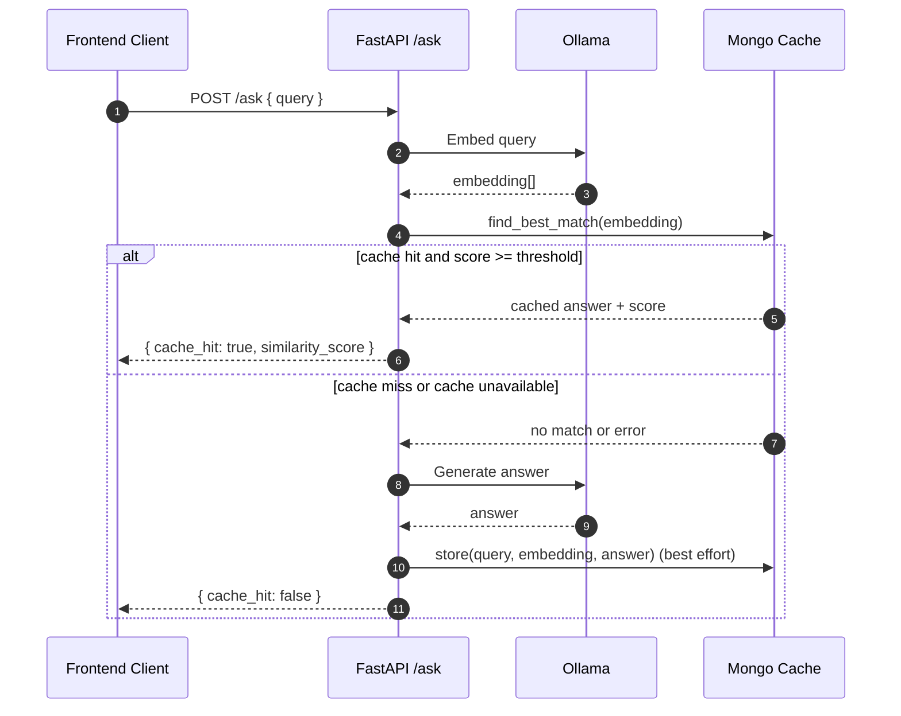

# Semantic Cache for Local LLMs

[](https://www.python.org/)
[](https://fastapi.tiangolo.com/)
[](https://react.dev/)
[](https://www.mongodb.com/atlas)
[](https://ollama.com/)

A full-stack semantic cache for local LLM workloads.

## At a Glance

| Layer         | Implementation                                |
| ------------- | --------------------------------------------- |
| API           | FastAPI (`/health`, `/ask`)                   |
| Inference     | Ollama (`nomic-embed-text`, `llama3`)         |
| Vector Search | MongoDB Atlas / Atlas Local (`$vectorSearch`) |
| Frontend      | React + Vite terminal-style UI                |

This project shows how to:

- embed incoming prompts
- retrieve semantically similar answers from a vector index
- fall back to fresh generation on misses or cache failures
- return predictable API responses with request correlation IDs

Stack: FastAPI backend, React frontend, Ollama for local models, and MongoDB vector search.

Exact-match caches miss when prompts are reworded. This project reuses answers for semantically similar queries.

## System Architecture

```mermaid
flowchart LR
    UI[React Terminal UI]
    API[FastAPI API]
    SVC[SemanticCacheService]
    OLLAMA[Ollama Client]
    CACHE[Mongo Semantic Cache Repository]
    DB[(MongoDB Collection + Vector Index)]

    UI -->|POST /ask| API
    API --> SVC
    SVC -->|embed(query)| OLLAMA
    SVC -->|vector lookup| CACHE
    CACHE --> DB
    SVC -->|cache miss -> generate(query)| OLLAMA
    SVC -->|best-effort store| CACHE
```

## Request Lifecycle



## Core Capabilities

- Semantic lookup using MongoDB `$vectorSearch`
- Local-first inference pipeline via Ollama
- Fail-open behavior: request still succeeds when cache read/write fails
- Strict input validation and normalized query handling
- Structured error payloads and `X-Request-ID` response headers
- Configurable runtime behavior via environment variables
- MongoDB bootstrap script for collection and vector index creation

## Tech Stack

- Backend: FastAPI, Pydantic, Requests, PyMongo
- Frontend: React (Vite), Tailwind CSS
- Inference: Ollama (`nomic-embed-text`, `llama3` by default)
- Data Layer: MongoDB with Search / Vector Search

## Repository Layout

```text
backend/
  main.py                 # app factory, lifespan, middleware
  routes.py               # /health and /ask endpoints
  config.py               # validated settings from environment
  runtime.py              # dependency composition root
  setup_db.py             # collection + vector index provisioning CLI
  services/
    semantic_cache.py     # orchestration (embed, lookup, fallback, store)
    cache.py              # Mongo vector search and persistence
    ollama.py             # defensive Ollama API client
frontend/
  src/App.jsx             # terminal UI workflow
  src/components/*        # header, prompt composer, message rows
  src/lib/semanticCacheApi.js
tests/
  test_semantic_cache_service.py
  test_settings.py
```

## Local Setup

### 1) Prerequisites

- Python 3.11+
- Node.js 20+
- Ollama installed and running locally
- MongoDB Atlas or Atlas Local deployment with Search / `$vectorSearch` support

Pull default Ollama models:

```bash
ollama pull nomic-embed-text
ollama pull llama3
```

### 2) Install Dependencies

```bash
python3 -m venv venv
source venv/bin/activate
pip install -r requirements.txt

cd frontend
npm install
cd ..
```

### 3) Configure Environment

```bash
cp .env.example .env
```

Set `MONGODB_URI` in `.env` to your Atlas (or Atlas Local) connection string:

```env
MONGODB_URI=mongodb+srv://<username>:<url-encoded-password>@<cluster>.mongodb.net/?retryWrites=true&w=majority&appName=semantic-cache
```

### 4) Provision MongoDB Objects

```bash
./venv/bin/python -m backend.setup_db
```

### 5) Run the Application

Backend:

```bash
source venv/bin/activate
uvicorn backend.main:app --reload --env-file .env
```

Frontend (new terminal):

```bash
cd frontend
npm run dev
```

Default endpoints:

- Frontend: `http://localhost:5173`
- Backend API: `http://localhost:8000`
- OpenAPI docs: `http://localhost:8000/docs`

## Configuration Reference

| Variable                   | Purpose                                                     | Default                                                            |
| -------------------------- | ----------------------------------------------------------- | ------------------------------------------------------------------ |
| `MONGODB_URI`              | MongoDB Atlas/Atlas Local connection string used at runtime | `mongodb://127.0.0.1:27017/?directConnection=true` (code fallback) |
| `MONGODB_DATABASE`         | Database name                                               | `ai_cache`                                                         |
| `MONGODB_COLLECTION`       | Collection for cached entries                               | `queries`                                                          |
| `OLLAMA_BASE_URL`          | Ollama server URL                                           | `http://localhost:11434`                                           |
| `OLLAMA_EMBED_MODEL`       | Embedding model name                                        | `nomic-embed-text`                                                 |
| `OLLAMA_GENERATE_MODEL`    | Generation model name                                       | `llama3`                                                           |
| `EMBEDDING_DIMENSIONS`     | Vector dimensions for index                                 | `768`                                                              |
| `SIMILARITY_THRESHOLD`     | Minimum score to accept a hit                               | `0.85`                                                             |
| `VECTOR_INDEX_NAME`        | MongoDB vector index name                                   | `vector_index`                                                     |
| `VECTOR_FIELD_NAME`        | Vector field path in documents                              | `embedding`                                                        |
| `VECTOR_SEARCH_LIMIT`      | Max matches returned by search                              | `1`                                                                |
| `VECTOR_SEARCH_CANDIDATES` | Candidate pool for vector search                            | `20`                                                               |
| `MAX_QUERY_LENGTH`         | Backend query length ceiling                                | `2000`                                                             |
| `VITE_API_BASE_URL`        | Frontend API target                                         | `http://localhost:8000`                                            |
| `VITE_MAX_QUERY_LENGTH`    | Frontend query length ceiling                               | `2000`                                                             |

## API Contract

### `GET /health`

Response:

```json
{
  "status": "ok",
  "app_name": "Semantic Cache API",
  "version": "0.1.0"
}
```

### `POST /ask`

Request:

```json
{
  "query": "Why does semantic caching reduce latency?"
}
```

Response (cache hit):

```json
{
  "query": "Why does semantic caching reduce latency?",
  "answer": "Semantically similar prompts can reuse prior responses...",
  "cache_hit": true,
  "similarity_score": 0.94
}
```

Response (cache miss):

```json
{
  "query": "Why does semantic caching reduce latency?",
  "answer": "...freshly generated answer...",
  "cache_hit": false,
  "similarity_score": null
}
```

Error shape:

```json
{
  "detail": "Unable to reach the local Ollama service.",
  "code": "ollama_unavailable",
  "request_id": "1c8f..."
}
```

## Validation and Testing

Run backend tests:

```bash
./venv/bin/python -m unittest discover -s tests -v
```

Run frontend checks:

```bash
cd frontend
npm run lint
npm run build
```

## Notes

- Cache lookup/write failures do not block a response.
- Input is validated in both request schema and service logic.
- Settings are centralized in backend configuration.
- `X-Request-ID` is returned for request tracing.
